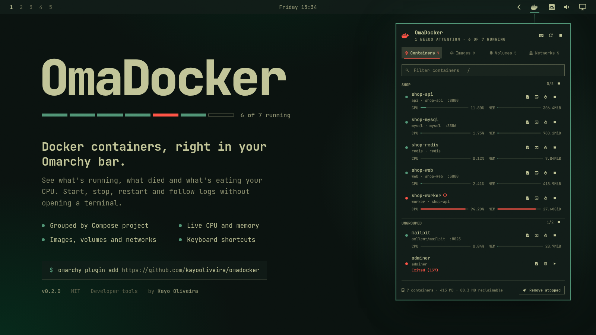

# OmaDocker


A complete, native Docker manager for the [Omarchy](https://omarchy.org/) shell.

Available on the [Omarchy Plugins directory](https://plugins.omarchy.org/plugin.html?id=kayooliveira.omadocker).

OmaDocker lives in your Omarchy status bar and gives you containers, images, volumes and
networks on four tabs — without ever opening a terminal, and without ever reaching for the
mouse if you would rather not.



## What it does

**Containers** — grouped by Compose project, running first, with live CPU and memory for
each one. Start, stop and restart a single container or a whole project; follow its logs or
drop into a shell inside it; a red dot and a warning glyph call out anything unhealthy,
crash-looping, or that exited badly.

**Images · Volumes · Networks** — each tab splits into **Unused** and **In use**, biggest
first, so what is costing you disk is the first thing you see. Docker itself decides what
counts as unused, so the list agrees with what `prune` would actually take.

**Reclaiming space** — the footer says what the current tab holds and how much of it is
reclaimable, straight from `docker system df`. One button — or the `p` key — prunes it, and
always asks first, naming exactly what is about to go.

**Getting out of your way when it goes wrong** — Docker refuses plenty of reasonable-looking
requests ("volume is in use", "image is referenced in multiple repositories"). OmaDocker
shows you its reason verbatim instead of failing silently.

## Keyboard

Everything in the panel is reachable from the keyboard. Press `?` inside the panel for this
same list.

### Moving around

| Key | Does |
| --- | --- |
| `1` – `4` | Jump straight to a tab |
| `h` `l` · `←` `→` | Previous / next tab |
| `j` `k` · `↑` `↓` | Move the cursor down / up |
| `/` | Jump into the filter box |
| `k` `↑` | From the first row, step back up into the filter |
| `esc` | Leave the filter, then close the panel |

### Containers

| Key | Does |
| --- | --- |
| `enter` | Start or stop the container |
| `r` | Restart it |
| `o` | Follow its logs in a terminal |
| `s` | Open a shell inside it |
| `n` | Copy its name |

### Cleaning up

| Key | Does |
| --- | --- |
| `x` | Remove whatever the cursor is on |
| `p` | Prune everything unused on this tab |

Both always ask first.

### The panel itself

| Key | Does |
| --- | --- |
| `c` | Copy the id, or a volume's mount path |
| `enter` | Copy, on the image, volume and network tabs |
| `u` | Refresh now |
| `d` | Open lazydocker |
| `?` | Show the shortcut sheet |

Clicking works everywhere too: a row copies its identifier, the buttons at its right edge do
what their tooltips say, and a project header starts or stops the whole project.

## Installation

```bash
omarchy plugin add https://github.com/kayooliveira/omadocker
```

Then add it to your bar layout, either via `~/.config/omarchy/shell.json` or the CLI:

```bash
omarchy bar move kayooliveira.omadocker --section right
```

## Requirements

- [Docker](https://docs.docker.com/engine/install/), reachable without `sudo`. Omarchy keeps
  accounts out of the root-equivalent `docker` group on purpose; run
  `omarchy setup security sudoless-docker` and reboot to get access the safe way.
- `wl-copy`, for the copy actions.
- A terminal, for logs and shells — OmaDocker uses whatever `omarchy-launch-tui` picks.

## Settings

Everything below is per-instance, from the Omarchy settings panel or `shell.json`.

| Setting | Default | What it changes |
| --- | --- | --- |
| Refresh interval | `15s` | How often the bar glyph re-reads Docker. The open panel refreshes every 3 seconds regardless. |
| Tab the panel opens on | `Containers` | Where the panel lands every time it opens. |
| Show stopped containers | on | Off lists only what is running. |
| Show CPU and memory | on | Off skips `docker stats` entirely — worth it on a laptop. |
| Measure what each volume costs | on | Off keeps the volume list instant and leaves per-volume sizes blank. The reclaimable total still works. |
| Hide the bar icon when empty | off | On removes the button until Docker has something to show. |

## IPC

```bash
omarchy shell kayooliveira.omadocker toggle
omarchy shell kayooliveira.omadocker tab volumes
omarchy shell kayooliveira.omadocker refresh
omarchy shell kayooliveira.omadocker stopAll
```

Handy for a Hyprland bind:

```
bind = SUPER CTRL, D, exec, omarchy shell kayooliveira.omadocker toggle
```

## Development

Clone into your Omarchy plugins directory and the shell picks it up:

```bash
git clone https://github.com/kayooliveira/omadocker ~/.config/omarchy/plugins/kayooliveira.omadocker
```

Everything that is not drawing is in `Model.js` — parsing Docker's output, deciding what is
unused, sorting, sectioning, building rows, and building the commands. It is a plain
`.pragma library` with no QML in it, so it runs under Node:

```bash
node tests/run.js
```

The QML on top of it is four files: `Panel.qml` owns state and processes, `TabStrip.qml` is
the tab bar, `ResourceList.qml` draws whichever tab is showing, and `ShortcutSheet.qml` is
the `?` overlay.

## License

MIT License
