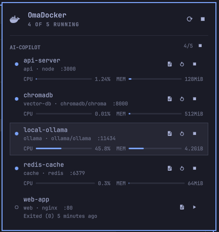

# OmaDocker


A complete, native Docker container manager for the [Omarchy](https://omarchy.org/) shell.

Omadocker integrates directly into your Omarchy status bar, providing a beautiful and fast way to manage your Docker containers without ever opening a terminal.



## Features

- **Live Container Status**: See at a glance which containers are running (green) or stopped (gray).
- **Resource Usage**: Real-time CPU and Memory usage for active containers.
- **Quick Actions**: 
  - Start, Stop, and Restart containers with a single click.
  - "Stop All" button for quick teardown.
- **Integrated Terminal Logs**: Click "Logs" to instantly open your default Omarchy terminal tailing the container's logs (`docker logs -f`).
- **Quick Copy**: Click anywhere on a container's row to instantly copy its ID to your clipboard.
- **Image Names**: Easily identify containers by their underlying Docker image.

## Installation

You can install Omadocker directly using the Omarchy plugin manager:

```bash
omarchy plugin add https://github.com/kayooliveira/omadocker
```

Then, add it to your bar layout (either via `~/.config/omarchy/shell.json` or the CLI):

```bash
omarchy bar move kayooliveira.docker --section right
```

## Requirements

- [Docker](https://docs.docker.com/engine/install/) (Ensure your user is in the `docker` group so it can run without `sudo`).
- `jq` (Used for parsing Docker CLI output).
- `wl-copy` (Used for clipboard integration).

## Development

If you want to contribute or modify the plugin:

1. Clone the repository into your Omarchy plugins directory:
```bash
git clone https://github.com/kayooliveira/omadocker ~/.config/omarchy/plugins/kayooliveira.docker
```
2. Omarchy shell automatically hot-reloads on every save. No restart required!

## License

MIT License
